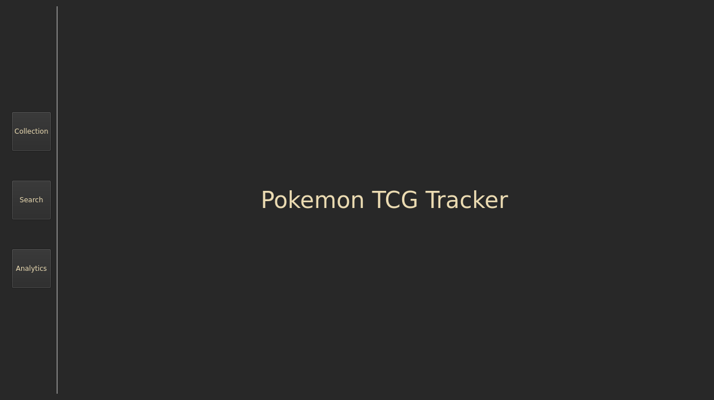
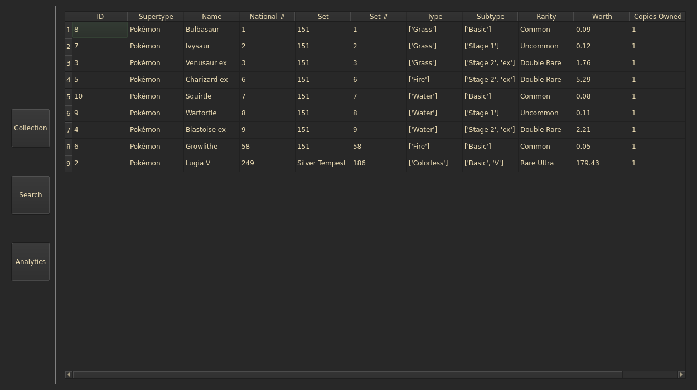
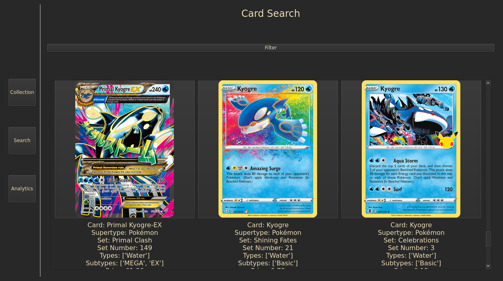
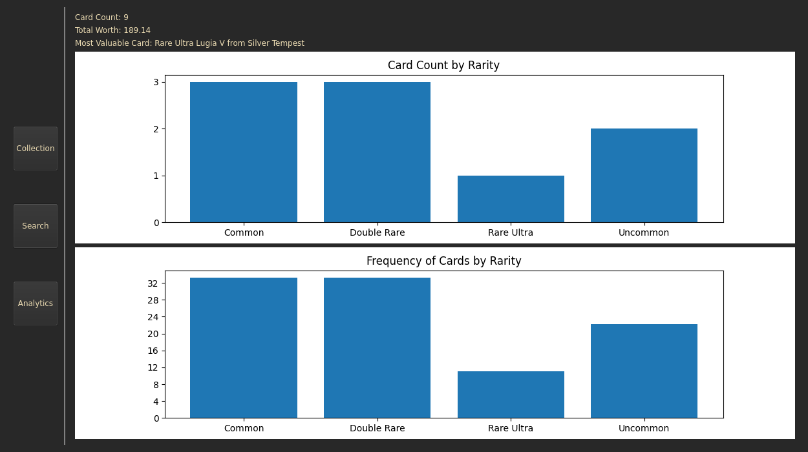

# pokemon-tcg-tracker

This program allows users to view all released English Pokemon cards as well as track their own collections.

## Personal Collections

The personal collection feature allows users to track their card collection with their tracking information

### Tracking Information

The available information being tracked are:

* Card Supertype
* Card Name
* Pokemon National Dex # (if applicable)
* Pokemon TCG Set
* Pokemon Type
* Pokemon Subtype
* Rarity
* Count
* Worth

## Searching Cards

Users can search for cards directly from the app in order to add cards to their collection

### Filters

The available filters are:

* Card Supertype
* Card Name
* Pokemon National Dex # (if applicable)
* Pokemon TCG Set
* Pokemon Type
* Pokemon Subtype

## Analytics

The analytics page provides a high level overview of the user's card collection

### Insights

The available insights are:

* Total card count in the collection
* Total worth of the collection
* Graph of cards by rarity
* Graph of cards by rarity frequency